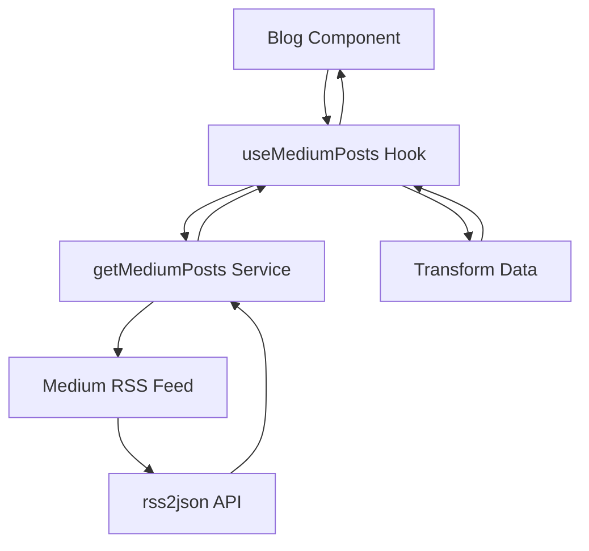

# Medium Post Fetcher Implementation Design

## Overview

This document outlines the design for implementing a Medium post fetcher feature that dynamically retrieves blog posts from a Medium RSS feed using the rss2json API. The implementation will replace the current static blog data with live data fetched from Medium, while maintaining the existing UI components and user experience.

## Architecture

The solution will follow a client-side data fetching approach using React hooks and the Fetch API. The implementation will:

1. Create a dedicated service function to fetch Medium posts
2. Implement a custom React hook to manage the data fetching logic
3. Modify the existing Blog component to use the new hook
4. Create a data transformation layer to map Medium API response to the existing blog data structure

## Implementation Plan

### 1. Medium API Service Function

Create a service function to fetch posts from the Medium RSS feed via rss2json API:

```typescript
// src/lib/medium.ts
export async function getMediumPosts() {
	try {
		// Hardcoded credentials as specified
		const username = "deltatigaenam";
		const apiKey = "feyvp3rgk8qno7pgf0iwgby5rglyicevz4jdrnrg";

		// Construct the RSS URL
		const rssUrl = `https://medium.com/feed/@${username}`;
		const encodedRssUrl = encodeURIComponent(rssUrl);

		// Construct the full API URL
		const apiUrl = `https://api.rss2json.com/v1/api.json?rss_url=${encodedRssUrl}&api_key=${apiKey}&count=10&include=content,thumbnail&order_by=pubDate&order_dir=desc`;

		const response = await fetch(apiUrl);

		if (!response.ok) {
			const error = new Error(
				`Medium API error: ${response.status} ${response.statusText}`
			);
			(error as any).status = response.status;
			(error as any).statusText = response.statusText;
			throw error;
		}

		const data = await response.json();

		if (data.status !== "ok") {
			const error = new Error(data.message || "Failed to fetch articles");
			(error as any).data = data;
			throw error;
		}

		return data.items || [];
	} catch (error) {
		if (error instanceof Error) {
			throw error;
		}
		throw new Error(
			"An unknown error occurred while fetching Medium posts"
		);
	}
}
```

### 2. Custom React Hook

Create a custom hook to manage the Medium post data:

```typescript
// src/hooks/use-medium-posts.ts
import { useState, useEffect } from "react";
import { getMediumPosts } from "@/lib/medium";
import { BlogPost } from "@/data/blogs";

export interface MediumPost {
	title: string;
	pubDate: string;
	link: string;
	guid: string;
	author: string;
	thumbnail: string;
	description: string;
	content: string;
	enclosure: any;
	categories: string[];
}

export const useMediumPosts = () => {
	const [posts, setPosts] = useState<BlogPost[]>([]);
	const [loading, setLoading] = useState(true);
	const [error, setError] = useState<string | null>(null);

	useEffect(() => {
		const fetchPosts = async () => {
			try {
				setLoading(true);
				const mediumPosts = await getMediumPosts();

				// Transform Medium posts to match existing BlogPost structure
				const transformedPosts: BlogPost[] = mediumPosts.map(
					(post: MediumPost) => ({
						slug: generateSlug(post.title),
						title: post.title,
						excerpt: post.description,
						content: post.content,
						date: post.pubDate,
						category: post.categories[0] || "Uncategorized",
					})
				);

				setPosts(transformedPosts);
			} catch (err) {
				setError(
					err instanceof Error ? err.message : "Failed to fetch posts"
				);
			} finally {
				setLoading(false);
			}
		};

		fetchPosts();
	}, []);

	// Helper function to generate URL-friendly slugs
	const generateSlug = (title: string): string => {
		return title
			.toLowerCase()
			.replace(/[^a-z0-9]+/g, "-")
			.replace(/^-+|-+$/g, "");
	};

	return { posts, loading, error };
};
```

### 3. Modified Blog Component

Update the existing Blog component to use the new hook:

```typescript
// src/pages/Blog.tsx
import { Helmet } from "react-helmet-async";
import { useLocation, Link } from "react-router-dom";
import { useMediumPosts } from "@/hooks/use-medium-posts";

const Blog = () => {
	const location = useLocation();
	const canonical = `${window.location.origin}${location.pathname}`;
	const { posts, loading, error } = useMediumPosts();

	if (loading) {
		return (
			<main className="container py-12">
				<h1 className="text-3xl font-bold mb-6">Blog</h1>
				<p>Loading posts...</p>
			</main>
		);
	}

	if (error) {
		return (
			<main className="container py-12">
				<h1 className="text-3xl font-bold mb-6">Blog</h1>
				<p>Error loading posts: {error}</p>
			</main>
		);
	}

	return (
		<main className="container py-12">
			<Helmet>
				<title>Blog | PT. Delta Tiga Enam</title>
				<meta
					name="description"
					content="Latest articles and insights from our team."
				/>
				<link rel="canonical" href={canonical} />
			</Helmet>
			<h1 className="text-3xl font-bold mb-6">Blog</h1>
			<section className="grid gap-6 md:grid-cols-3">
				{posts.map((p) => (
					<article
						key={p.slug}
						className="rounded-lg border p-6 bg-card shadow-sm"
					>
						<span className="text-xs text-primary font-medium">
							{p.category}
						</span>
						<h2 className="mt-2 font-semibold mb-1">
							<Link to={`/blog/${p.slug}`}>{p.title}</Link>
						</h2>
						<p
							className="text-sm text-muted-foreground mb-4"
							dangerouslySetInnerHTML={{ __html: p.excerpt }}
						/>
						<Link
							className="story-link text-sm"
							to={`/blog/${p.slug}`}
						>
							Read more
						</Link>
					</article>
				))}
			</section>
		</main>
	);
};

export default Blog;
```

### 4. Blog Post Component Update

Update the BlogPost component to handle Medium content:

```typescript
// src/pages/BlogPost.tsx
import { Helmet } from "react-helmet-async";
import { useLocation, useParams } from "react-router-dom";
import { useMediumPosts } from "@/hooks/use-medium-posts";

const BlogPost = () => {
	const location = useLocation();
	const canonical = `${window.location.origin}${location.pathname}`;
	const { slug } = useParams();
	const { posts, loading, error } = useMediumPosts();

	const post = posts.find((p) => p.slug === slug);

	if (loading) {
		return (
			<main className="container py-12">
				<p>Loading post...</p>
			</main>
		);
	}

	if (error) {
		return (
			<main className="container py-12">
				<p>Error loading post: {error}</p>
			</main>
		);
	}

	if (!post) {
		return (
			<main className="container py-12">
				<p>Post not found</p>
			</main>
		);
	}

	return (
		<main className="container py-12">
			<Helmet>
				<title>{post.title} | Blog | PT. Delta Tiga Enam</title>
				<meta name="description" content={post.excerpt} />
				<link rel="canonical" href={canonical} />
			</Helmet>
			<article className="max-w-3xl mx-auto">
				<header className="mb-8">
					<span className="text-sm text-primary font-medium">
						{post.category}
					</span>
					<h1 className="text-3xl font-bold mt-2 mb-4">
						{post.title}
					</h1>
					<time className="text-sm text-muted-foreground">
						{new Date(post.date).toLocaleDateString("en-US", {
							year: "numeric",
							month: "long",
							day: "numeric",
						})}
					</time>
				</header>
				<div
					className="prose max-w-none"
					dangerouslySetInnerHTML={{ __html: post.content }}
				/>
			</article>
		</main>
	);
};

export default BlogPost;
```

## Data Flow Diagram



## Key Features

1. **Dynamic Content Fetching**: Fetches latest Medium posts on component mount
2. **Error Handling**: Gracefully handles API errors and network issues
3. **Loading States**: Provides visual feedback during data fetching
4. **Data Transformation**: Maps Medium API response to existing data structure
5. **SEO Compatibility**: Maintains Helmet integration for SEO
6. **Static Deployment Compatible**: Works with static hosting like cPanel

## Security Considerations

1. API key is hardcoded as requested but should be moved to environment variables in production
2. Content sanitization is handled by dangerouslySetInnerHTML - consider adding a sanitization library for additional security
3. CORS is handled by the rss2json API service

## Performance Considerations

1. Client-side fetching may impact initial load time
2. Consider implementing caching mechanism for better performance
3. Pagination could be added for better UX with large datasets

## Testing Strategy

1. Unit test the `getMediumPosts` service function with mock responses
2. Test the `useMediumPosts` hook with various loading states
3. Integration test the Blog component with mocked hook responses
4. End-to-end test to verify the complete data flow
